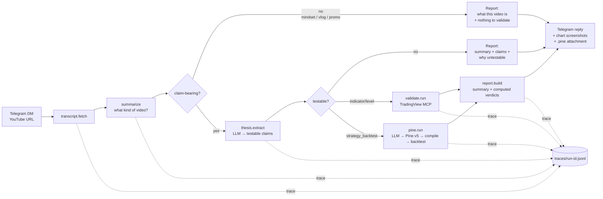

# trading-hypothesis-lab


*Give it a YouTube trading video and it returns an honest verdict: transcript fetch → claim extraction → validation against real market data → `holds` / `fails` / `untestable`. It says `untestable` whenever the video doesn't actually make a checkable claim — which is most of the time.*

I got tired of watching trading videos that confidently claim a strategy "works consistently" with nothing to back it up. So I built a system that checks.

You give it a YouTube URL. It pulls the transcript, figures out what kind of video it is, extracts any claims that could actually be tested against market data, and then tests them — with real data, through TradingView, using explicit rules. The report tells you what it found, how confident the numbers are, and exactly where the reasoning stopped if it couldn't conclude anything.

It's not a trading bot. It doesn't generate signals or execute trades. The domain is trading content. The engineering pattern — deterministic evaluation, observable workflows, graceful degradation — applies to any autonomous research pipeline operating under uncertainty.

**The repo does two things now.** The pipeline above judges a *video's* claim. A second tool — the **rigor checker** — judges a *strategy you already have*: paste a Pine script and it scores whether the backtest is trustworthy (not whether it's profitable). Same philosophy, sharper target. Scroll to **The rigor checker** below.

**→ Read [`docs/REASONING.md`](docs/REASONING.md) for the deep-dive on the design choice that defines this system: why "untestable" is a first-class verdict, and why most autonomous validation systems get this wrong.** Also published as an essay: [Why "untestable" is a first-class verdict](https://rsaipavan.substack.com/p/why-untestable-is-a-first-class-verdict).

*Built by [R Sai Pavan](https://www.linkedin.com/in/sai-pavan-86635b23/) · saipavan.pilot1@gmail.com*

---

## What this looks like in practice

The ICT Silver Bullet strategy has fully mechanical rules: liquidity sweep of a prior session high or low, followed by a displacement candle, a market structure shift, and a retracement entry into the fair value gap. Stop above/below the first FVG candle. Target 2:1 or the opposing liquidity level. Minimum 15 pips (forex) or 10 points (indices).

The extractor formalized all of it. Then it stopped.

```
Claim extracted:
  During 3–4 AM, 10–11 AM, and 2–3 PM New York time: enter on a retracement into a
  fair value gap following a liquidity sweep + displacement candle + market structure
  shift. Stop above/below the first FVG candle. Target 2:1 or opposing liquidity
  (min 15 pips forex / 10 points indices).
  → test_type: strategy_backtest | testable: no

Why not tested:
  Entry, stop, and target rules are fully mechanical and testable, but no specific
  instrument is named — "forex" and "indices" are categories, not tickers.
```

It did not guess EURUSD. It did not guess ES1!. It did not fabricate a win rate. It said what it knew and stopped.

That's the epistemic floor. The pipeline only backtests what the video actually specified. A claim that is missing a required input — instrument, timeframe, or measurable outcome — gets classified `untestable` with one sentence explaining exactly what's missing.

This matters because the alternative — assuming EURUSD, synthesizing a Pine Script, reporting "67% win rate" — would be a hallucination with a confidence interval attached. The system is designed to produce fewer results, not more confident ones.

---

## What you need before running this

**Python 3.10+** — check with `python --version`.

**Claude Code (the `claude` CLI)** — this is the default LLM backend for claim extraction and Pine Script synthesis. Install it from [claude.ai/code](https://claude.ai/code) or via npm:
```bash
npm install -g @anthropic-ai/claude-code
```
Once installed, run `claude` once to authenticate with your Anthropic account. No API key setup needed — it uses your Claude subscription. If you'd rather use the Anthropic or Gemini API directly, see the LLM backend section below.

**YouTube transcripts** — the pipeline pulls captions from YouTube via `youtube-transcript-api`. This works on any video that has transcripts enabled (auto-generated or manual). If a video has transcripts disabled, the run returns `untestable — no transcript available` and stops. Most trading tutorial videos have auto-captions.

**TradingView Desktop + MCP** *(for live validation only)* — without this, the pipeline still runs but all validation steps return `untestable — MCP not configured`. Claim extraction, classification, and reporting all still work. To enable live validation:

1. Install [TradingView Desktop](https://www.tradingview.com/desktop/) and open it
2. Enable remote debugging: launch TradingView with `--remote-debugging-port=9222` (or set it in the app's launch options)
3. Install the TradingView MCP server — follow the setup at [github.com/tradingview/tradingview-mcp](https://github.com/tradingview/tradingview-mcp)
4. Set `TRADINGVIEW_MCP_CMD` in your `.env` to the command that launches the MCP server

**Strategy backtests are off by default.** `config.yml` has `strategy_backtest: false` in v1. If you run a strategy video without enabling it, the claim will be extracted and classified correctly but marked `untestable — test type disabled`. To enable: set `strategy_backtest: true` in `config.yml` and make sure the TradingView MCP is configured.

---

## Try it

```bash
pip install -e .
python -m trading_hypothesis_lab.orchestrate "https://www.youtube.com/watch?v=..."
```

What happens:

```
Transcript fetched      — pulls and cleans the YouTube transcript
        ↓
Video classified        — is this a strategy claim, market commentary, a course pitch?
        ↓
Claims extracted        — each claim tagged: instrument, timeframe, test type, testable?
        ↓
Claim operationalized   — trigger condition + outcome window formalized into a runnable test
        ↓
Validation executed     — real market data via TradingView MCP; strategy claims get Pine Script synthesized, compiled, and backtested
        ↓
Verdict computed        — thresholds applied in code, not asked of the LLM: holds / partial / fails / untestable
```

Here's real output from [`examples/06_orb_pine_strategy_backtest/`](examples/06_orb_pine_strategy_backtest/):

```
Claim extracted:
  ORB: enter long when price closes above the first-15-minute high, enter short when
  price closes below the first-15-minute low. Stop at the opposite end of the opening
  range. Target 1.5x range size. Exit all positions by 3 PM. Works consistently on SPY.
  → instrument: SPY | timeframe: 5m | test_type: strategy_backtest | testable: yes

Validation:
  Pine Script synthesized → compiled (0 errors) → strategy tester run
  66 trades | win rate 48% | net profit −4,082 | profit factor 0.91 | max drawdown 6,560

Verdict:
  NOT SUPPORTED — no edge: profit factor 0.91, net profit −4,082.41 over 66 trades
```

The trace for that run:

```jsonl
{"step": "transcript.fetch",  "ok": true, "ms": 0,     "detail": "fetched 218 words"}
{"step": "video.summarize",   "ok": true, "ms": 312,   "detail": "strategy_or_claim — ORB intraday strategy — SPY 5-minute"}
{"step": "thesis.extract",    "ok": true, "ms": 1847,  "detail": "1 claim: 1 testable, 0 not"}
{"step": "pine.run",          "ok": true, "ms": 28340, "detail": "PF 0.91 over 66 trades — net negative"}
{"step": "report.build",      "ok": true, "ms": 4,     "detail": "verdict_overall=fails; 1 claim"}
```

Everything saves to `runs/<run_id>/` — transcript, summary, extracted claims, report, trace, and the `.pine` file if one was generated.

---

## How it works



**Step 1 — Ingest.** `transcript.py` fetches and cleans the YouTube transcript.

**Step 2 — Summarize.** Before extracting any claims, `summarize.py` figures out what kind of video this is — strategy walkthrough, educational explainer, market commentary, course pitch, vlog. If it's the kind of video that doesn't make checkable claims by nature (mindset content, promos), the pipeline stops here and returns a summary-only report. No point extracting claims from a sales pitch.

**Step 3 — Extract.** For claim-bearing videos, `thesis.py` pulls out the testable claims. Each one gets tagged with instrument, timeframe, test type, and a judgment on whether it's actually testable — with a reason if not. The extractor is expected to say "that's a take, not a claim." It also gets prior failure traces injected from the knowledge base, so it knows what's gone wrong on similar claims before.

**Step 4 — Validate.** Two paths depending on claim type. Indicator and level claims go to `validate.py`, which fetches OHLCV data from TradingView, computes the relevant indicator in Python, and measures the hit rate over a multi-year lookback. Strategy claims go to `pine.py`, which synthesizes a complete Pine Script strategy from the transcript, compiles it via TradingView MCP with an LLM self-repair loop (up to 3 fix attempts), runs the strategy tester, and returns real backtest metrics.

**Step 5 — Report.** `report.py` leads with what the video actually is, then walks through each claim — what was said, what was testable, what the data showed, and why the system concluded what it did. Verdicts come from explicit thresholds applied to the validation data, not from asking the LLM to judge anything. If a strategy is a consistent loser to the point that reversing every entry and exit would have cleared the holds threshold, the report flags that as a hypothesis mutation finding.

**Step 6 — Reply.** If you're running the Telegram bot, it sends live progress updates as each step completes (editing a single status message rather than spamming), chart screenshots, trade overlays for strategy claims, the full report, and the `.pine` file as an attachment.

**Step 7 — Accumulate.** Every run appends to `knowledge/store.jsonl` — how the claim was formalized, what failure modes came up, what the validation found. The next time a similar claim comes through, the extractor gets those prior traces as context. Not self-improving trading. Self-improving reliability.

**Step 8 — Trace.** Every step writes one line to `traces/<run-id>.jsonl` with timing and outcome. The examples in this repo include their full traces so you can see exactly what the system did on each run.

---

## The rigor checker — is this backtest trustworthy?

The video pipeline judges someone else's *claim*. The rigor checker judges a strategy *you already have*: **paste a TradingView Pine strategy and it scores whether the backtest is trustworthy — not whether it's profitable.** Most strategy backtests that look incredible are quietly fooling their author — look-ahead bias, a sample too small to mean anything, an "edge" that only exists on one timeframe, or one that evaporates the instant you add commission. This finds that.

```bash
python -m trading_hypothesis_lab.rigor strategy.pine --instrument SPY --timeframe D
python -m trading_hypothesis_lab.rigor strategy.pine -i BINANCE:BTCUSDT -t 240 --instruments ETHUSD
```

Two static gates read the source (look-ahead, repainting). Then an empirical battery runs — and here's the part that matters: **it needs no TradingView, no subscription, no API key beyond your LLM backend.** It infers which well-known archetype the strategy is (RSI mean-reversion, MA/MACD cross, Supertrend, Bollinger reversion, Donchian breakout, opening-range breakout), re-implements it in a small **lookahead-free** Python engine, and backtests it on **free OHLCV** (Yahoo, installed automatically). That unlocks the checks that actually catch self-deception:

- **Out-of-sample** — a real date split; does the edge survive unseen data?
- **Inverse-edge** — reverse every entry and exit; if *that* also wins, the signal is noise, not direction.
- **Multi-timeframe / multi-instrument** — is the edge real, or a cherry-pick?
- **Friction** — how much of it survives realistic commission and slippage?

A Sonnet 4.6 deep review reads the source for the subtler issues a regex misses, and the final grade is reasoned **in context** — a scalper and a swing system don't get held to the same trade count.

Real output — a Supertrend trend-follower on BTC:

```
Grade: Likely overfit (33/100) — the decisive factor is the out-of-sample collapse:
in-sample PF 2.54 crashing to OOS PF 0.66 means it's a net loser on unseen data.

G1 Look-ahead      PASS   no future-data access
G2 Repainting      PASS   confirmed-bar evaluation
G3 Sample          PASS   102 trades — enough to conclude
D1 Out-of-sample   FAIL   in-sample PF 2.54 → OOS PF 0.66 — curve-fitting
D5 Inverse-edge    PASS   inverse PF 0.05 — the directional edge is real, not a coin flip
```

It's honest about its own reach: the engine models the strategy's *inferred logic*, not the literal Pine on TradingView — every scorecard says so and reports the inference confidence. A strategy that maps to no known archetype, or fires too few trades, gets `not_assessed` on the affected checks, which caps the grade below *Robust*. You can't be rated robust on a check that never ran — the same epistemic floor as the rest of the repo.

Worked example with the full scorecard: [`examples/rigor_supertrend_btc_overfit/`](examples/rigor_supertrend_btc_overfit/). Full rubric: [`docs/rigor_rubric.md`](docs/rigor_rubric.md).

---

## Code layout

```
src/trading_hypothesis_lab/
├── telegram_bot.py    # input/output edge: listens for YouTube URLs, sends live progress + charts + report
├── transcript.py      # YouTube transcript fetch + clean
├── summarize.py       # transcript → "what kind of video is this?" (runs first; routes the pipeline)
├── thesis.py          # transcript + summary → testable claims (via llm.py); injects prior failure traces
├── validate.py        # claim → validation run via TradingView MCP (indicator/level claims)
├── pine.py            # claim → Pine Script v5 → compile → backtest → ValidationRun (strategy claims)
├── report.py          # summary + validation runs → report (verdicts computed, not LLM-judged)
├── orchestrate.py     # the sequential pipeline; logs each step to traces/; fires step callbacks
├── knowledge.py       # pattern-aware validation memory: operationalization failure traces, hypothesis mutation
├── watchlist.py       # predefined symbol lists (default, nifty50, sp500, crypto, forex, commodities)
├── llm.py             # backend-agnostic LLM: claude CLI (default) | Anthropic API | Gemini API
├── mcp_client.py      # thin TradingView MCP client (retries, error → untestable, never crashes a run)
├── config.py          # loads config.yml + .env
├── types.py           # the dataclasses passed between modules
│   # ── the rigor checker (second capability; TradingView-independent) ──
├── rigor.py           # paste a Pine strategy → trustworthiness scorecard (gates + dims + grade)
├── backtest.py        # 7 strategy archetypes + lookahead-free backtest engine + Pine→archetype inference
├── empirical.py       # runs the rigor battery (OOS split, inverse-edge, multi-TF/instrument) → EmpiricalResults
└── freedata.py        # free OHLCV (Yahoo) + TradingView-symbol/timeframe mapping, cached

knowledge/
└── store.jsonl        # append-only operationalization memory (committed; grows across runs)
```

Each module has one job and a small typed interface. The full data contract is in [`docs/architecture.md`](docs/architecture.md).

---

## The design choices that matter

A few things I kept coming back to while building this:

**Verdicts come from code, not the model.** The LLM extracts claims and synthesizes Pine Script. It doesn't decide whether a claim holds. That decision comes from thresholds applied to real numbers — hit rate, profit factor, trade count. Same data always gives the same verdict. You can audit it.

**Every failure mode has a name and a return value.** Nothing silently crashes or returns a misleading result. If the transcript is empty, that's a named outcome. If the MCP times out, that's a named outcome. If the Pine Script won't compile after 3 attempts, the file still gets saved, the run still completes, and the trace says exactly what happened. The system degrades — it doesn't disappear.

**"Untestable" is a first-class result.** Most of the examples in this repo end with `untestable`. That's the system working correctly, not failing. A lot of trading content doesn't make checkable claims — it makes predictions, narratives, and sales pitches. Saying so clearly is more useful than manufacturing a test result.

**The trace is always there.** Every run leaves a `trace.jsonl` with one line per step — timing, outcome, detail. Not for debugging (though it helps there too). For trust. Anyone reading the report can open the trace and see exactly what the system did.

**The memory accumulates across runs.** `knowledge/store.jsonl` grows with every run, and the extractor gets prior failure traces as context. If ORB has failed to compile three times due to ambiguous exit rules, the next ORB extraction knows that. The system gets more reliable over time, not by learning what's profitable, but by learning where the operationalization breaks down.

---

## Examples

[`examples/`](examples/) has real YouTube trading videos run through the full pipeline. Each folder is a complete run: transcript, extracted claims, validation, report, and trace. Read one to see exactly what the system did and why.

| Example | Video type | Verdict |
|---------|-----------|---------|
| [01 — RSI + Bollinger Bands backtest](examples/01_rsi_bollinger_tested_2025/) | Strategy backtest (video author's own test) | untestable — no MCP-resolvable claims |
| [02 — RSI: profitable or overhyped?](examples/02_rsi_profitable_or_overhyped/) | Strategy backtest (10 assets × 3 timeframes) | untestable — multi-asset portfolio + underspecified exit rule |
| [03 — RSI divergence on XAUUSD](examples/03_rsi_divergence_xauusd/) | Educational explainer | untestable — strategy without named instrument |
| [04 — AlphaInsider promo walkthrough](examples/04_alphainsider_promo_walkthrough/) | Promotion | untestable — no checkable claim |
| [05 — ORB acceptance short, no claims](examples/05_orb_acceptance_short_no_claims/) | Short / mindset | untestable — no claims |
| [06 — ORB Pine strategy backtest](examples/06_orb_pine_strategy_backtest/) | Strategy claim | fails — 66 trades, 48.5% WR, PF 0.91 (net negative) |
| [07 — ICT key levels framework](examples/07_ict_key_levels_educational/) | Educational framework | untestable — teaching a methodology, no specific claim |
| [08 — SPY 200-day SMA support](examples/08_spy_200sma_support_holds/) | Indicator claim | **holds** — 73% of 52 occurrences, above 65% threshold |

---

## Run history (live)

Aggregated outcomes across every video I've put through the pipeline. These numbers are computed from the committed example reports by [`scripts/run_history.py`](scripts/run_history.py) — re-run it to refresh as the corpus grows. The point isn't to look impressive; it's to show the verdict distribution the design actually produces.

| Metric | Count | % |
|--------|-------|---|
| Total videos processed | 8 | 100% |
| Videos producing a testable claim | 2 | 25% |
| Verdict: `pass` (claim holds against data) | 1 | 12% |
| Verdict: `fail` (claim contradicted by data) | 1 | 12% |
| Verdict: `partial` (mixed evidence) | 0 | 0% |
| Verdict: `untestable` (claim well-formed but unverifiable) | 6 | 75% |
| Verdict: `error` (pipeline failure, recoverable next run) | 0 | 0% |

**Top reasons for `untestable`:**
- 4 — strategy/claim described without a specific instrument
- 3 — strategy rules underspecified (no exit/target rule — can't replicate exactly)
- 3 — no checkable claim extracted (promotional / mindset / educational video)
- 2 — a point made in passing, not a falsifiable claim

The `untestable` plurality is expected and is the point. Most trading content is uncheckable. A system that produces verdicts for everything is producing fabrications.

---

## Running it

```bash
# install
pip install -e .

# one-shot: prints the report and saves the full bundle to runs/<run_id>/
python -m trading_hypothesis_lab.orchestrate "https://www.youtube.com/watch?v=..."

# test indicator claims across multiple timeframes
python -m trading_hypothesis_lab.orchestrate "https://youtu.be/..." --timeframe 60,240,D,W

# scan a claim across an entire watchlist
python -m trading_hypothesis_lab.orchestrate "https://youtu.be/..." --watchlist nifty50

# run the Telegram bot
python -m trading_hypothesis_lab.telegram_bot

# rigor-check a Pine strategy (no TradingView needed)
python -m trading_hypothesis_lab.rigor strategy.pine -i SPY -t D --instruments QQQ
```

**No API key needed by default.** The pipeline auto-detects an LLM backend in this order:

1. The `claude` CLI on your PATH ([Claude Code](https://claude.ai/code)) — uses your existing subscription, no key needed
2. `ANTHROPIC_API_KEY` set — `pip install 'trading-hypothesis-lab[anthropic]'`
3. `GEMINI_API_KEY` set — free tier works fine — `pip install 'trading-hypothesis-lab[gemini]'`

For the Telegram bot, set `TELEGRAM_BOT_TOKEN` in `.env`. For live validation, set `TRADINGVIEW_MCP_CMD` to the command that launches your TradingView MCP. Without it, validation steps return `untestable — MCP not configured` and everything else still runs fine.

Copy `.env.example` → `.env` to get started. `config.yml` controls timeframes, verdict thresholds, and which test types are enabled.

Watchlists available with `--watchlist`:

| Name | What it is |
|------|-----------|
| `default` | 16 cross-market symbols: SPX, NDX, DJI, DAX, NIFTY, BTCUSD, ETHUSD, EURUSD, XAUUSD, USOIL, and more |
| `nifty50` | 50 Nifty 50 constituents (NSE India) |
| `sp500` | 50 S&P 500 large-caps |
| `crypto` | 10 major crypto pairs |
| `forex` | 10 major FX pairs |
| `commodities` | 8 commodities |

---

## What this isn't

No live trading. No exchange connections. No strategy library. No "AI finds profitable setups." Adding any of that would make this a worse repo, not a better one.

---

## Docs

- [`docs/REASONING.md`](docs/REASONING.md) — **start here** — why "untestable" is a first-class verdict, the design choice that defines this system
- [`docs/rigor_rubric.md`](docs/rigor_rubric.md) — the rigor checker's full rubric: gates, scored dimensions, and how the TradingView-independent engine runs
- [`docs/decision_logic.md`](docs/decision_logic.md) — how the system decides what counts as a testable claim and which test type to run
- [`docs/validation_logic.md`](docs/validation_logic.md) — what the validation actually does, what it can and can't conclude
- [`docs/failure_handling.md`](docs/failure_handling.md) — every failure mode documented: no transcript, ambiguous claim, MCP error, compile failure — what happens and why
- [`docs/architecture.md`](docs/architecture.md) — module boundaries, data contracts, the compile-repair loop design

---

## License

MIT
